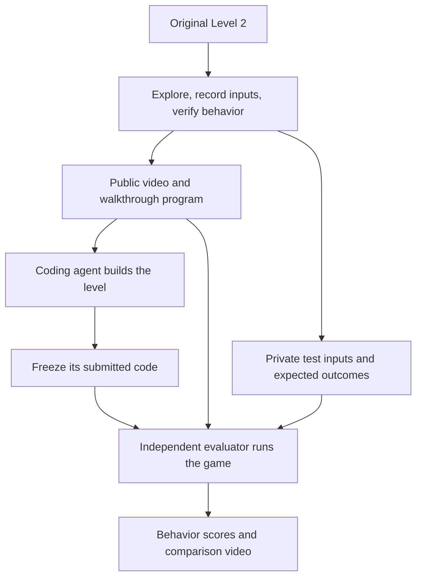

> Historical design overview, preserved as background. Its proposed specification-driven grader and five-repeat gate are not the current screenshot-first recreation experiment. The closing status below records the earlier design stage, not today's replay status. See [the canonical README](../README.md) and [observed replay results](reference-replay-results.md) for current instructions and evidence.

**Start by building a reliable replay of the original level.** That is the foundation: if the controller sometimes fails on the original, it cannot fairly judge a recreation.

I researched agent-evaluation guidance, game-recreation benchmarks, and browser automation. I saved the full design in [the benchmark plan](benchmark-plan.md).

For this project, I’d build a **one-level pilot** with the following structure.

**1. Establish the reference**

Use **Forest Temple Level 2**, identified by its two hanging logs above green pools. First, confirm the mechanics in the actual browser release we select.

Then:

- Establish a repeatable way to start that level.
- Produce one successful walkthrough program.
- Replay it from a fresh start five times.
- Record the walkthrough and short demonstrations of button release, log movement, hazards, and restart.
- Save the game version, browser settings, screen size, inputs, and recordings.

Five successful repeats would be our initial engineering check. It would establish that the replay is usable before we spend money on models.

**2. Separate preparation, building, and judging**

The coding agent receives:

- The video and walkthrough program.
- Screenshots and synchronized input annotations.
- A concise description of required mechanics.
- A starter project and preinstalled tools.
- The scoring categories and build budget.

The evaluator retains the original game, hidden tests, expected outcomes, and scoring code. Those must be inaccessible from the candidate’s workspace.

This separation follows the isolation approach used in [GameReplica](https://arxiv.org/html/2609.22308v1). Our proposed grader would emphasize executed behavior.

**3. Build a small runner**

My proposed stack is:

| Component | Purpose |
|---|---|
| **TypeScript + Playwright** | Launch the browser, send keyboard inputs, reset, and capture evidence |
| **Input traces stored as JSON** | Reuse exactly the same actions across implementations |
| **Isolated build environments** | Give each model a fresh workspace with the same dependencies |
| **Independent grading scripts** | Evaluate submitted games without letting them alter the tests |
| **JSON/CSV results and an HTML report** | Preserve scores, costs, failures, and videos |

A local command-line workflow is enough initially.

One technical issue needs investigation immediately: **timing**. Playwright supports keyboard control and clock manipulation, but we must verify that controlled timing works correctly with this particular game. Its clock API does not automatically guarantee deterministic game physics. [Keyboard documentation](https://playwright.dev/docs/api/class-keyboard), [clock documentation](https://playwright.dev/docs/clock)

**4. Grade mechanics individually**

The main walkthrough checks end-to-end completion. Additional scenarios check six groups:

| Group | What earns credit |
|---|---|
| Movement and collisions | Both characters respond correctly and respect solid boundaries |
| Hazards | Safe and unsafe character/pool combinations behave correctly |
| Cooperation | Buttons and the barrier respond correctly to activation and release |
| Seesaws | Logs react to character placement and maintain correct contact |
| Progression | The route works and completion requires the correct conditions |
| Restart | Initial positions and state are restored |

Report **full behavioral pass/fail**, component scores, and visual fidelity separately. A beautiful recreation with flat logs should visibly fail the seesaw requirement.

For positions, angles, and timing, establish acceptable ranges from reference observations. Exact pixel equality would be unnecessarily brittle.

This combination of local behavioral checks, reference-input replay, and separate visual assessment is supported by [SWE-Game’s evaluation design](https://arxiv.org/html/2609.33678v1).

**5. Test the grader before testing the models**

We need evidence that it:

- Accepts a correct recreation.
- Rejects deliberately broken versions: flat logs, an always-open barrier, incorrect hazard immunity, or premature completion.
- Rejects an animation that plays the walkthrough regardless of input.

Initially, human-check the automated verdicts. Automate confidently once the checks agree with observed behavior. A reference solution and deliberate defects help validate the grader, an approach consistent with [agent-evaluation guidance](https://www.anthropic.com/engineering/demystifying-evals-for-ai-agents).

**6. Run a small calibration, then freeze the experiment**

Start with one development attempt per model. Use those runs to identify ambiguity, tool problems, and whether the difficulty is useful.

Then freeze the prompt, evidence, tests, tolerances, tools, and budget. Run **three fresh attempts per model**—nine final trials for your three models. Keep development results separate and preserve every attempt.

Record exact model versions, settings, cost, time, tool usage, and failure reasons. Since the aim is to expose failures, make each failure explainable: *incorrect log physics* is useful evidence; *the browser lost keyboard focus* is an infrastructure problem.

**Our first implementation milestone should be: “The original Level 2 reliably replays from a fresh start, and we have its recording plus verified mechanic demonstrations.”** The earlier browser security-check failure still leaves live access unverified; that needs resolving before capture. The architecture and implementation sequence are now documented, but no replay or grader has been validated yet.
