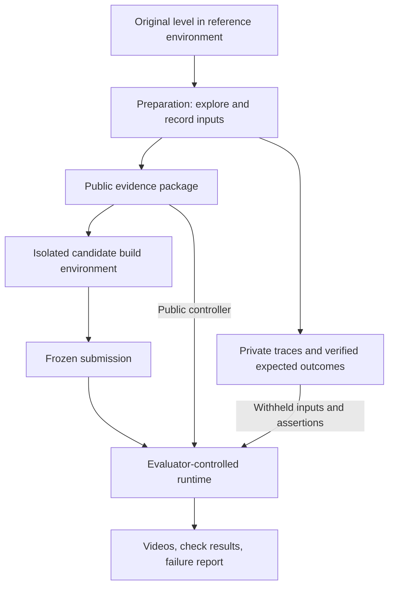

# Fireboy and Watergirl recreation benchmark

Design draft — 4 October 2026. Selected task: Fireboy and Watergirl 1, The Forest Temple, Level 2, identified by the two hanging logs above green pools. This plan is researched; no original-game replay, capture, grader, or candidate run has been validated. The earlier live browser attempt failed because its security check was unavailable. Resolve that access normally before live work; do not bypass it.

## 1. What the pilot measures

Question: Given fixed gameplay evidence and the controller that produced it, can an agent implement a browser-playable recreation of one level that reproduces the demonstrated mechanics under both the supplied route and withheld actions?

The candidate receives video, synchronized inputs, screenshots, concise observable requirements, a starter project, and the public controller. It produces game source. The evaluator freezes that output and tests it independently.

This is a multimodal coding/recreation case study. It combines observation, specification recovery, implementation, and debugging. It does not by itself establish general coding ability or general intuition. Playing the original is task preparation, not a scored capability in this condition.

The aim is to expose substantive implementation failures. Difficulty must come from interacting mechanics. An invalid reference, unreliable controller, undisclosed rule, or impossible tolerance is an evaluation defect. Development results are useful for selecting difficulty but must be labelled as development results.

## 2. First deliverable: reference replay feasibility

Build this before model-provider integration or automatic scoring.

1. Confirm the actual Level 2 layout and mechanics in one selected browser release. Record its URL/build identity, initial screenshot, controls, viewport, browser version, scale, and startup procedure. Level numbering alone is insufficient identification.
2. Establish a repeatable reset into the level. Record any unlock/save setup privately. Begin the scored trace after the level is ready, not during ads, loading, menus, or browser focus changes.
3. Have the exploration agent produce one successful input trace. A human can correct it during task authoring; disclose that if relevant. Store all key-down and key-up events, including overlapping inputs for both characters.
4. Replay that trace from clean starts five times as a practical pilot gate. Verify the same milestones and successful ending each time. Five repeats are an engineering check, not a statistical guarantee.
5. Capture short demonstrations of button release, log tilt/contact, hazards, death, and restart. Confirm facts from the chosen release; guides are discovery aids.
6. Preserve the evidence and manifest. If an authorized, self-contained local reference can be pinned, use it. A hosted release can support an exploratory pilot but remains subject to changes and loading variability; report that limitation.

Exit criterion: one trusted route, reliable reset, observed mechanic definitions, saved evidence, and measured timing variability. If the controller cannot replay reliably, repair the harness or change the execution protocol before charging models for trials.

## 3. Architecture and trust boundaries



Use one trusted orchestrator with three roles/environments. These can share a machine, but candidate code must not share access to grader files, original source, secrets, previous submissions, or reference browser debugging ports.

- **Reference environment:** original game, preparation controller, reference captures, measurements, and any private reset setup. During final grading, use frozen reference evidence or a validated reference run.
- **Build environment:** one clean workspace per attempt containing only the public package and preinstalled dependencies. File editing, terminal, and local browser feedback are available under the same limits for each model. Candidate network access is disabled; model requests go through the trusted host. Original-game browsing would be a different experimental condition.
- **Evaluation environment:** executes the submitted app with network access disabled. The controller, expected results, and score writer remain outside the submitted app's filesystem/process access. Browser input reaches the game; test names and expected answers do not. The app may observe its inputs, as any playable game does.

Copy only final source/assets into evaluation. Rebuild in a fresh environment; do not reuse the agent's development browser or cached state. Hash the submission before grading and preserve it alongside the task version.

## 4. Minimal technical stack

Recommended implementation: TypeScript/Node for orchestration; a pinned Chromium and Playwright for the eventual browser runner; JSON input traces; browser capture plus a video assembly tool for the comparison; local JSON/CSV and a static HTML report for results. Container isolation is appropriate for candidate execution. Start with a local command-line workflow; a database, dashboard service, job queue, and agent framework migration are unnecessary for one task.

Candidate output: a static browser game using the supplied JavaScript/TypeScript starter, keyboard controls, and a fixed game viewport. Preinstall the same small dependency set for every model, including an optional physics library if chosen before freezing. Do not require a particular internal physics algorithm.

The public controller runs outside the submission and is evaluator-owned during grading. The candidate can read it and use it locally, but its edits to a copied controller cannot affect the evaluator's version.

## 5. Inputs, time, reset, and capture

Represent gameplay as data consumed by the same runner, with an explicit clock mode and key states. A conceptual action is: hold ArrowRight and KeyD for a specified duration, release ArrowRight, continue holding KeyD, then release all. Publish the coordinate system, key mapping, supported simultaneous inputs, viewport, and reset contract.

Prefer controlled stepping only after verifying compatibility with the original. Playwright offers clock control over timers and animation frames; this does not guarantee deterministic behavior for this particular game, workers, or its physics engine. Install any clock instrumentation before game initialization. Use incremental advancement that processes animation frames; jumping over timers is unsuitable for a physics replay. A pinned real-time run with measured timing windows is the fallback.

Do not equate an automation wait of 16 milliseconds with one game simulation frame. Log requested inputs, observed timing, and frame captures separately. Test the same timing protocol on the reference and every submission.

Reset uses a fresh browser context and known startup steps. A submission can provide a ready signal, but the evaluator also verifies the initial rendered scene. Launch/reset adapters may differ between reference and candidate; the scored gameplay trace remains identical. Avoid teleporting characters into private internal states in the first version. Short mechanic tests should reach their starting points through real inputs.

Record at a fixed output size. If simulation time is manually advanced, collect timestamped frames and assemble the review video at the intended playback rate; a wall-clock browser video may not represent simulated time faithfully. Keep raw frames and timing logs. Finalize browser videos by closing their recording context.

## 6. Public evidence package

- Successful Level 2 walkthrough, as short as the route naturally takes.
- Controller source and its input trace.
- A fixed screenshot/keyframe set and input annotations, distributed identically to every model.
- Short mechanic demonstrations or clear descriptions covering every required scored behavior.
- A requirements sheet: layout, controls, jumps/collisions, hazards, cooperative barrier, tilting logs, collectibles if included, exits, and reset behavior.
- Starter app, preinstalled dependencies, launch/reset instructions, and public smoke check.
- The frozen resource limits, scoring categories, and disclosure that hidden action sequences exercise the same documented mechanics.

Keep audio reproduction out of scope. Require recognizable characters, hazards, platforms, and layout; score decorative fidelity separately. Supply the same reusable assets if available; otherwise explicitly permit drawn graphics and state the visual standard before runs.

For comparable evidence access, choose a common image/video inspection tool. If one model lacks native video support, provide all models the same extracted-frame tools and frames as the main condition. Native-video comparisons can be a separate condition. Timestamp inputs accurately; a few still images alone may conceal the seesaw dynamics.

## 7. Private scenario catalogue

Each scenario has an ID, a public requirement it tests, reset/setup inputs, probe inputs, reference observations, tolerances, timeout, and evidence frames. Freeze before final comparison.

| Scenario | Probe and expected evidence |
|---|---|
| Public completion | Run the supplied route; check progress through the level and both-character completion. |
| Neutral control | After normal startup, supply no gameplay input for a matched interval; the game must not replay the demonstrated route or complete automatically. |
| Movement and walls | Exercise both control sets separately and together; approach a solid boundary and check that it blocks movement. |
| Button dependency | Reach the cooperative barrier, hold the activating button, then release it. Check the reference transition and whether an unheld button allows passage. |
| Log interaction | Reach a hanging log, land at different positions, pause, then move or jump. Compare tilt direction/range and supported character movement with original observations. |
| Elemental hazards | Cover safe and unsafe character/pool combinations, including the shared deadly pool where accessible. Check visible survival/death, not merely position changes. |
| Exit dependency | Reach one exit first and then the other; verify when the completion condition changes. |
| Restart | After death or progress, reset and check the reference initial arrangement and cleared progress. |

These are proposed probes, not verified scripts. In particular, exact log response, angle bounds, button transitions, and reset semantics remain to be measured. A public demonstration of a tilted log is needed before scoring equivalent unseen placements. Do not introduce unseen physics requirements.

Capture both positive and negative cases. For example, a platform that always tilts fails an unloaded/neutral control; a barrier that always stays closed fails the activation case.

## 8. Grader design

**Primary result:** strict behavioral pass — launch plus all required behavioral groups pass. **Secondary result:** equal-weight average of the six groups below, with separate presentation scoring. Multiple hazard permutations do not get extra weight merely because there are more of them.

1. Movement and solid collisions.
2. Elemental hazards and death.
3. Button/barrier cooperation.
4. Log dynamics and character support.
5. End-to-end progression and exit conditions.
6. Restart/state restoration.

For each group, specify the constituent required checks before freezing. Show check-level results, rather than only a percentage. Public route failure and local mechanic failures should remain distinguishable.

The initial observer reads evaluator-captured frames. Annotate reference regions for characters, log endpoints/angles, barrier positions, and terminal screens. Develop modest image detectors only for these features and validate them against manually labelled clips. Position, angle, and event windows need tolerances derived from reference variability and a correct independent implementation, not arbitrary pixel equality.

Begin with human verification of every pilot verdict, then automate the repeated checks that prove reliable. Uncertain perception results require review; they are not automatically model failures. An app-supplied debug/state API may help diagnose failures but must not be the sole grading authority. A candidate-written `passed: true` or fabricated log angle earns no credit.

If a probe cannot reach its setup because the candidate has broken movement, record `setup_failed` and identify the prerequisite. It does not pass; the diagnostic should not falsely claim a separately observed seesaw defect. Reference setup failures and broken evaluator detectors are infrastructure/unscorable cases and must be fixed or adjudicated before publishing scores.

Preserve raw synchronized replay for timing evidence. A separately labelled milestone-aligned video is useful for review, but never silently stretch candidate time to make the replay appear correct. Avoid a single whole-video similarity score: background pixels can dominate it and timing drift can overwhelm local correctness.

## 9. Validate the grader before comparing models

Require the reference to pass the positive checks and produce the expected negative outcomes repeatedly. Then use a correct independently implemented replica to show that reasonable alternative code and rendering can pass. Without this, the reference proves replay reliability but does not prove the grader accepts valid recreations.

Create deliberate defective variants of that replica: flat logs, permanently open barrier, swapped hazard immunity, completion after only one exit, failed reset, and an input-independent replay animation. The appropriate checks must reject them. Use these to discover blind spots, not as candidate training material.

If full automation becomes more expensive than the pilot, retain a clearly labelled human-verified pilot with frozen rubrics and evaluator recordings. Do not describe it as fully automated until the detectors are validated. The larger benchmark's intended cost asymmetry emerges after setup; it is not free on the first run.

## 10. Run protocol and resource budget

Use exact model/API identifiers, reasoning settings, agent-loop version, dependency versions, task hash, environment image, and tool permissions. Names such as Luna alone are insufficient configuration records. Prefer the same agent harness and tools; otherwise label results as comparisons of model-plus-agent systems.

Provisional pilot: one development attempt per target model, inspected for grading defects and task ambiguity. If usable, freeze the protocol and run three fresh attempts per model. Three models therefore produce nine final trials; the three development attempts remain separate. This is an initial reliability sample, not enough for a broad ranking.

Choose a model-spend ceiling per attempt before dispatch. A provisional time ceiling of 30 minutes can be used during calibration, but publish it and adjust once on development data if startup or inspection consumes most of it. An outer monetary cap protects total spend. If monetary caps bind differently across models, describe the result as budget-constrained performance. Track wall time, input/output/other billable usage where reported, provider cost, tool calls, and repair iterations. Avoid claiming equal tokens are equal compute across providers.

Only the public tests are available during construction. Allow iteration within the frozen budget. At deadline or submission, stop the agent and archive source. Hidden grading has no feedback channel to the agent. Record all attempts; do not repeatedly rerun until one fails or report only the weakest output.

Timeout with a broken game is a candidate outcome. Provider outage, failed reference load, or evaluator crash is an infrastructure result. Define a limited retry rule in advance, keep original failures in the log, and rerun only infrastructure failures under that rule.

Familiar games may have prior exposure in model training. Blocking external source retrieval prevents direct copying during the run but cannot remove prior knowledge. Describe the task honestly as reconstruction of a known game. Broader generalization later requires multiple levels or new layouts, separate from development variants.

## 11. Suggested repository boundaries

```text
benchmark/
  docs/                 protocol and research notes
  runner/               trusted launch, input replay, capture, reporting
  task-public/          requirements, video, frames, controller, starter
  manifests/            task/build/environment hashes and measured settings
  experiments/          model settings and frozen resource limits
  results/              immutable submissions, traces, evidence, verdicts

private-evaluator/      separate storage, never mounted into candidate workspaces
  reference/            reference identity, reset setup, original evidence
  scenarios/            withheld traces and expectations
  calibration/          labels, tolerance decisions, defective variants
```

Directory names do not create isolation. Enforce boundaries with mounts, processes/containers, and network permissions. Keep credentials in the trusted host. Do not place secrets in public repository history or expose hidden traces through a browser page accessible to the candidate.

## 12. Implementation order and stop/go gates

| Order | Deliverable | Gate |
|---|---|---|
| 1 | Original-level reset, input trace, and capture | Same route works from five fresh starts; actual Level 2 mechanics confirmed. |
| 2 | Public task package and three mechanic branches | Every scored requirement is observable; all private probes work on the reference. |
| 3 | Minimal trusted runner and evidence report | One command launches, replays, captures, and produces reviewable results. |
| 4 | Correct replica and deliberate defects | Correct code passes; flat-log and other targeted defects are caught. |
| 5 | Development model trials | Failures can be attributed to task performance versus evaluator/environment issues. |
| 6 | Frozen pilot comparison | Fresh independent trials, exact configurations, saved artifacts, no selective reporting. |

The first work session should end with a trustworthy original-game recording and replay, plus a short feasibility note. It should not end with an unsupported leaderboard. If original access or timing remains blocked, preserve this design and report that blocker before any model evaluation.

## Research basis

- [Anthropic: Demystifying evals for AI agents](https://www.anthropic.com/engineering/demystifying-evals-for-ai-agents): explicit task/trial/grader distinctions, isolated attempts, reference solutions, and grader validation. These inform the protocol and calibration gates.
- [SWE-Game, sections 3.3–3.4](https://arxiv.org/html/2609.33678v1): evaluator-owned behavioral probes, reference input replay, and separate visual assessment. Our design adapts the principle to a browser game without assuming access to its engine state.
- [GameReplica, sections 3.3–3.4](https://arxiv.org/html/2609.22308v1): separation of original-game observation from candidate code and isolation boundaries. Its judge-based scoring differs from our proposed execution-first grader; it does not validate this pilot's detectors.
- [SWE-bench harness](https://www.swebench.com/SWE-bench/reference/harness/): reproducible containerized execution as a precedent for environment pinning.
- [Playwright keyboard](https://playwright.dev/docs/api/class-keyboard), [clock](https://playwright.dev/docs/clock), and [video](https://playwright.dev/docs/videos): candidate building blocks for simultaneous inputs, controlled time, and recording. Compatibility with the original remains untested.
- [Forest Temple Level 2 guide](https://en.wikibooks.org/wiki/Fireboy_and_Watergirl_in_the_Forest_Temple/Level_2): preliminary mechanic identification, to be confirmed in the selected executable.

The concrete scope, sequencing, scoring groups, repeat count, and architecture are project recommendations, not established measured results for this game or these models.
